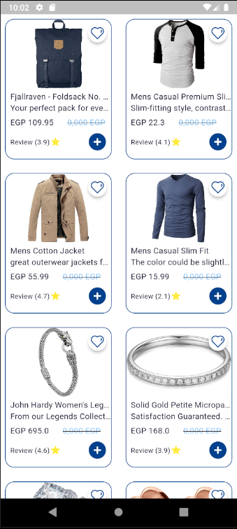

# Store App

A simple store app built with **Flutter**, implementing features like product listing, pricing, and reviews. This app demonstrates the use of popular Flutter design patterns and state management techniques.

## Features

- Product listing with pricing and reviews.
- Integration with an API using **Dio**.
- **Repository pattern** for data handling.
- **MVVM architecture** for separation of concerns.
- **Cubit** for state management.

